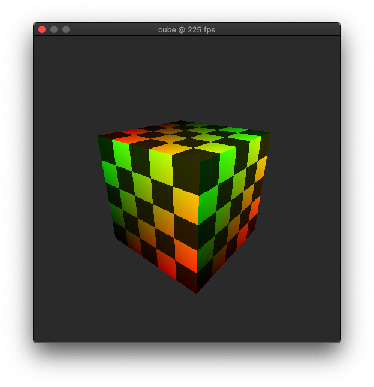

# *Soft*ware Triangle Renderer

This is a toy library written in a weekend that implements a triangle renderer
(such as one you would normally find inside a GPU) that runs on the CPU. The
library exposes an API that allows the user to render a triangulated model, and
exposes control over the vertex and fragment (pixel) stages of the render
pipeline through programmable shaders.

## Demo

As you can see we are drawing a cube with a gradient, and texturing it with a
checker texture. This is all done in the programmable shader, all while running
at a "respectable" 225 fps. See the [examples](examples/) directory for details.

